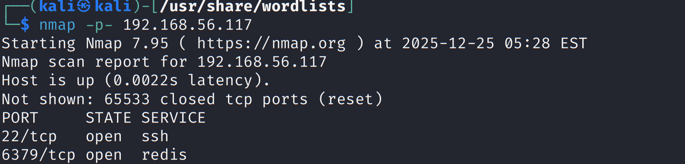
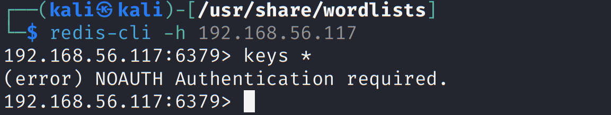
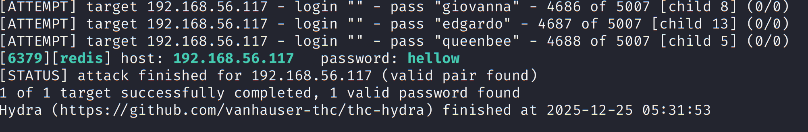
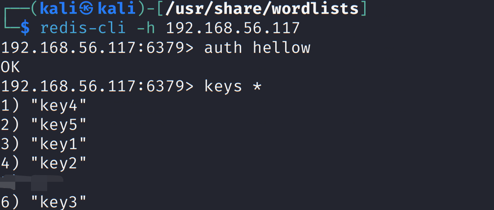
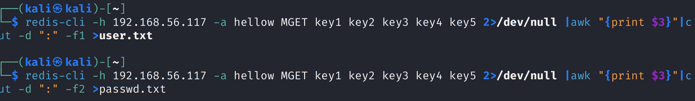
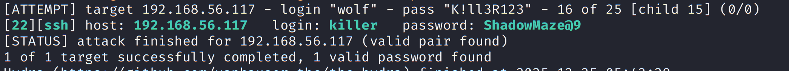
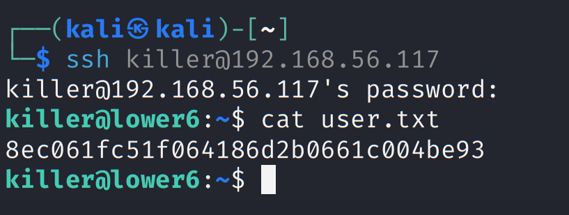
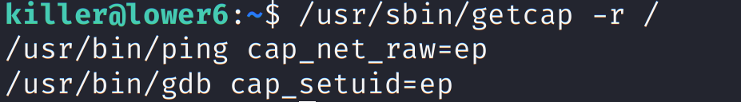
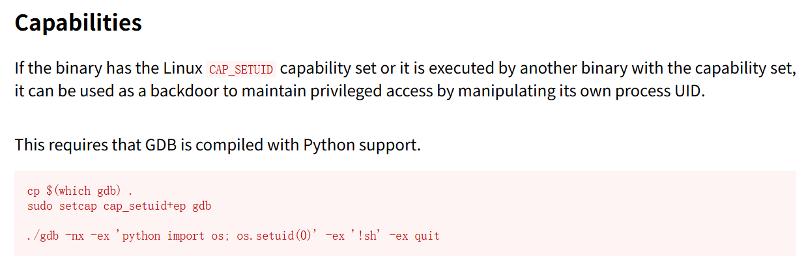
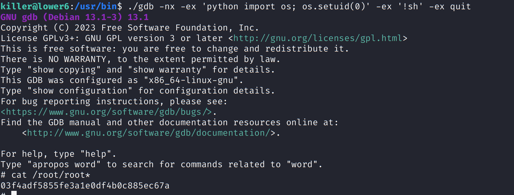

nmap扫描靶场



发现redis端口



redis需要密码

hydra -P ./nmap.lst redis://192.168.56.117 -V -I -f

爆破得到密码



连接拿到key



批量提取用户名和密码



然后爆破ssh

```
hydra -L user.txt -P passwd.txt ssh://192.168.56.117 -f -V -I
```





getcap提权



查看gdb用法




