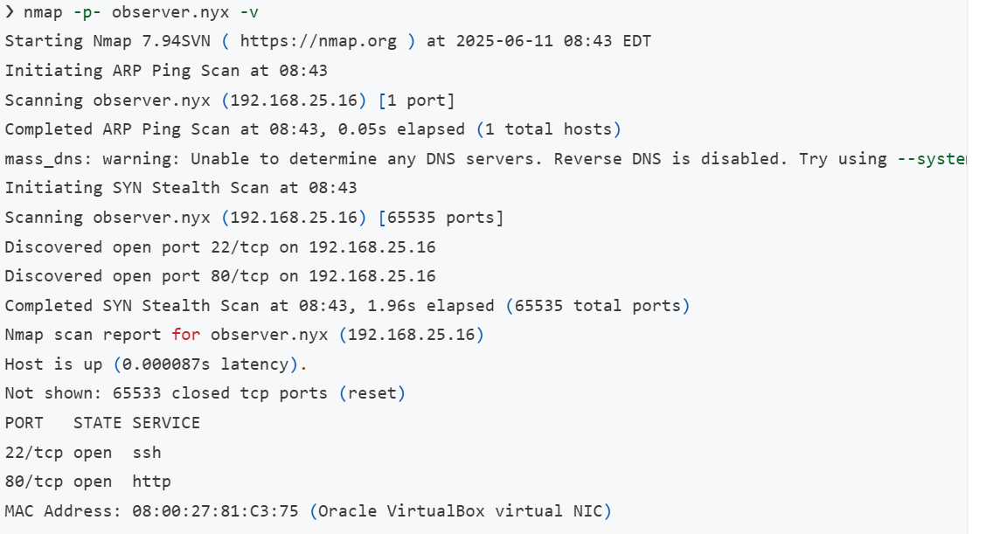
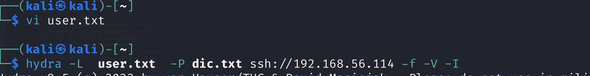
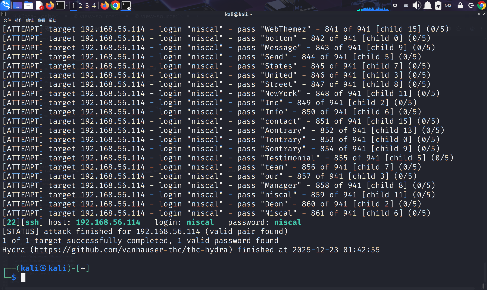
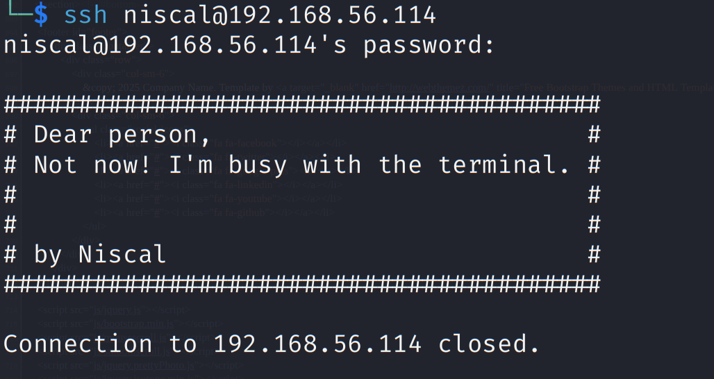
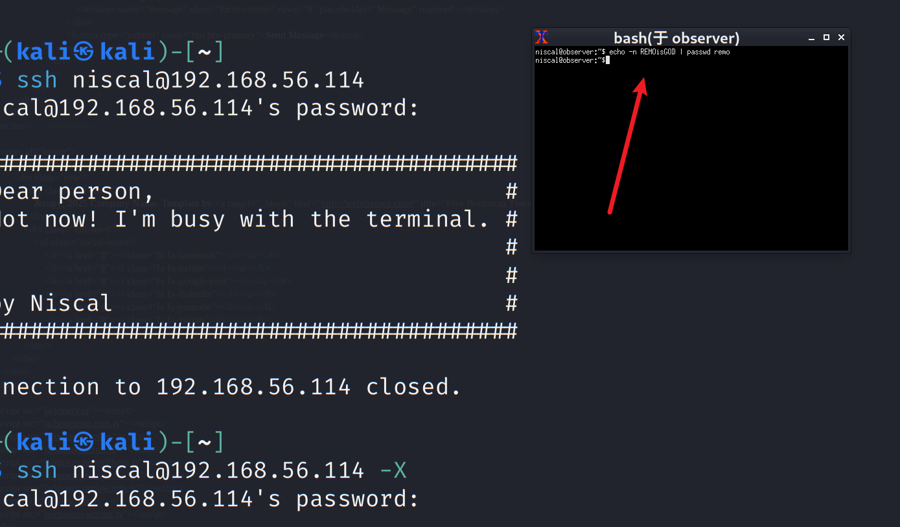
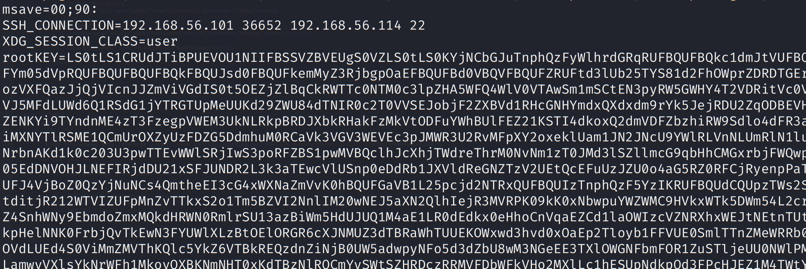
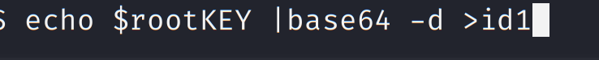
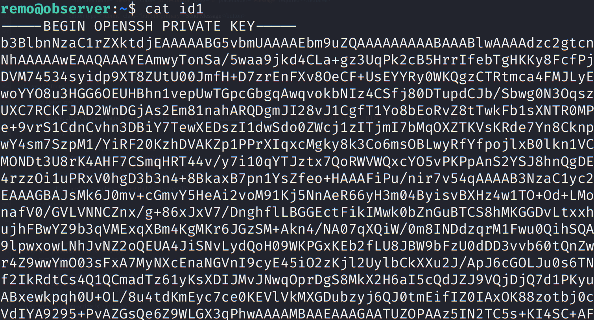
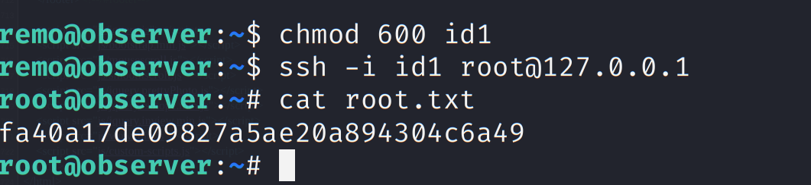

# vulnyx -Observer

nmap扫一下端口



我们可以看到，OpenSSH 正在端口 80 上运行`22`，Apache httpd 服务器正在端口 80 上运行。

扫描网页目录但是没有发现。

访问80网页


发现有人名，尝试ssh爆破。

用cewl生成密码字典。

```
cewl http://192.168.56.114 -w dict.txt
```







ssh登录不了。因此要用x11转发登录。



登录发现remo的凭证

```remo:REMisGOD```

ssh连接上，env发现rootkey变量。



是base64编码的私钥。我们解码为id文件。





```
remo@observer:~$ echo $rootKEY |base64 -d >id1
```

用它登录root



